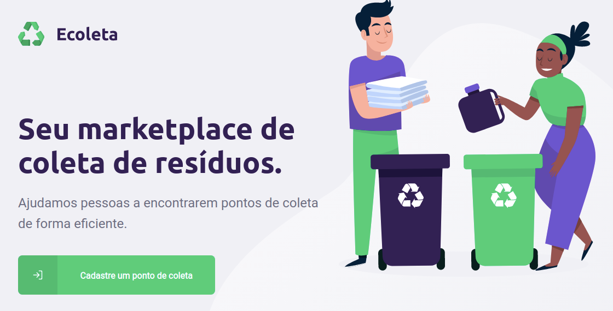

<h2 align="center"> 
	♻ Ecoleta
</h1>

<p align="center">
  <a href="https://www.linkedin.com/in/frank-laercio/">
    
  </a>
  
  
  
  <a href="https://github.com/franklaercio/Ecoleta/commits/master">
    
  </a>
  
  

  
   <a href="https://github.com/franklaercio/Ecoleta/stargazers">
    
  </a>
</p>

# Ecoleta

Project developed in partnership with Rocktseat at Next Level Work. This project aims to inform the points of collection of recyclable waste.
<p align="center">

</p>	
<p>
    
</p>	

## Getting Started

To start the project you need to install NodeJs, React, React Native and Sqlite3.

### Installing

#### Run server: 

```npm run dev```

#### Create migrates:

```knex:migrate```

#### Create seeders:

```knex:seed```

#### Run application WEB:

```yarn start```

##### or 

```npm start```

#### Run application mobile:

```expo start```

## Contributing

Please read [CONTRIBUTING.md](https://gist.github.com/PurpleBooth/b24679402957c63ec426) for details on our code of conduct, and the process for submitting pull requests to us.

## Versioning

We use [SemVer](http://semver.org/) for versioning. For the versions available, see the [tags on this repository](https://github.com/franklaercio/Ecoleta/tags). 

## Authors

* **Frank Laércio** - [franklaercio](https://github.com/franklaercio)

See also the list of [contributors](https://github.com/franklaercio/Ecoleta/contributors) who participated in this project.

## License

This project is licensed under the MIT License - see the [LICENSE.md](LICENSE.md) file for details

## Acknowledgments

* Recycling
* NodeJs
* React
* npm
* npm run dev
* expo start
* npm start

